**Alumno:** Tomas Cassanelli  
**Clave UCC:** 2102092

## Trabajo Practico N°1 - Git Básico
---

### 1- Instalar Git
  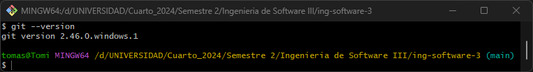
---

### 2- Crear un repositorio local y agregar archivos
  - Crear un repositorio local en un nuevo directorio.
  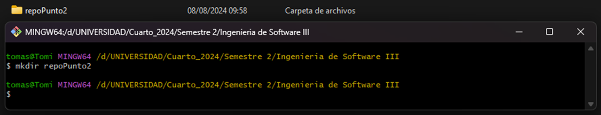

  - Agregar un archivo Readme.md, agregar algunas líneas con texto a dicho archivo.
  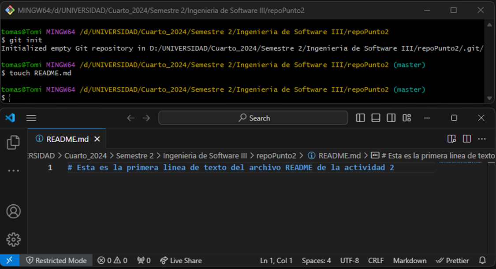

  - Crear un commit y proveer un mensaje descriptivo.
  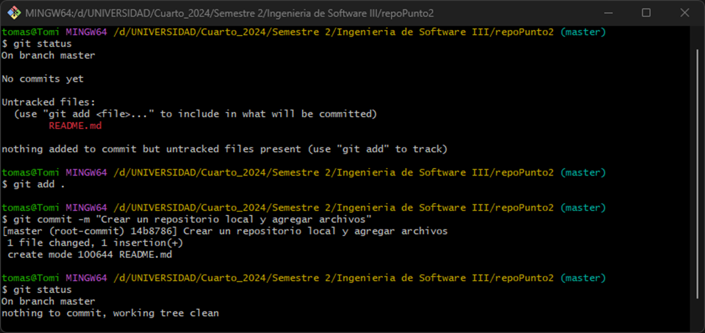
---

### 3- Configuración del Editor Predeterminado.
---

### 4- Creación de Repos 01 -> Crearlo en GitHub, clonarlo localmente y subir cambios.
  - Crear una cuenta en https://github.com -> https://github.com/TomiCassanelli

  - Crear un nuevo repositorio en dicha página con el Readme.md por defecto.
    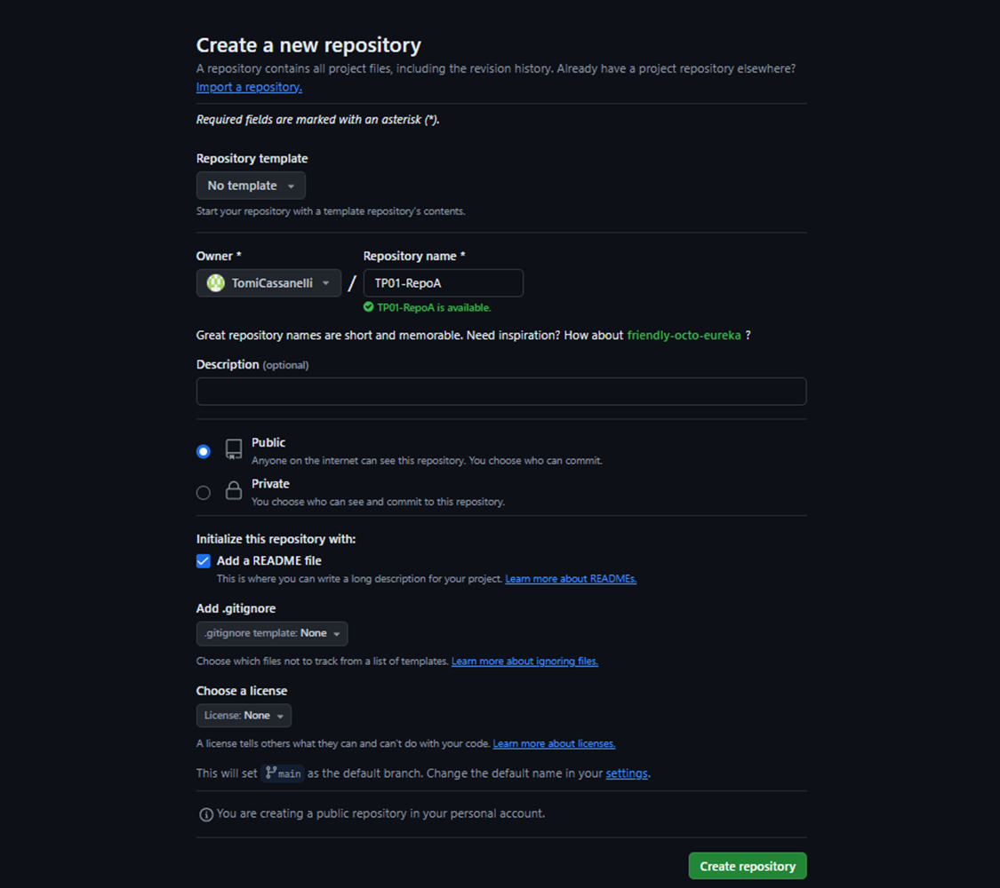
    
  - Clonar el repo remoto en un nuevo directorio local.
  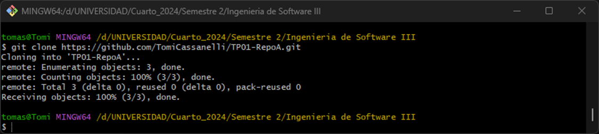

  - Editar archivo Readme.md agregando algunas lineas de texto.
  

  - Editar (o crear si no existe) el archivo .gitignore agregando los archivos *.bak
  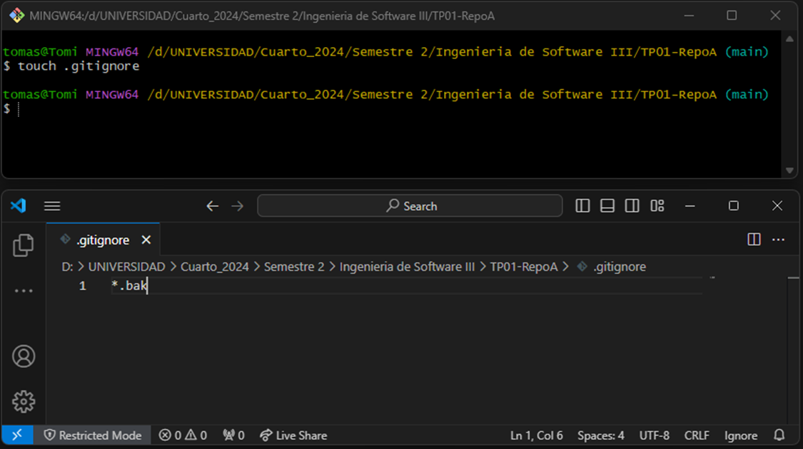

  - Crear un commit y proveer un mensaje descriptivo.
  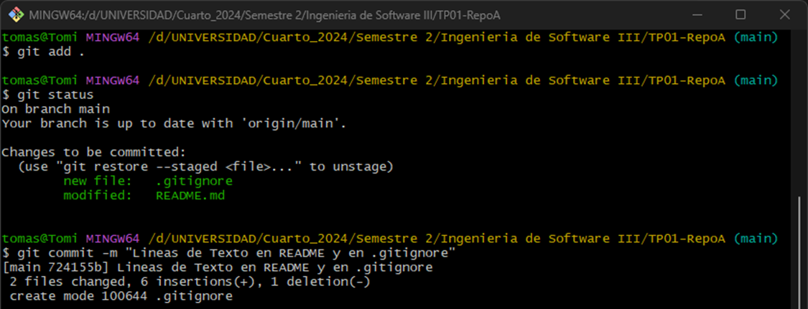

  - Intentar un push al repo remoto.
  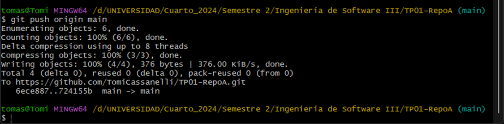

  - En caso de ser necesario configurar las claves SSH requeridas y reintentar el push.
---

### 5- Creación de Repos 02 -> Crearlo localmente y subirlo a GitHub
  - Crear un repo local
  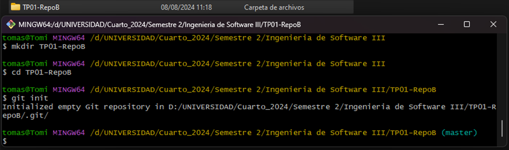 

  - Agregar archivo Readme.md con algunas lineas de texto
  - Crear archivo .gitignore  
  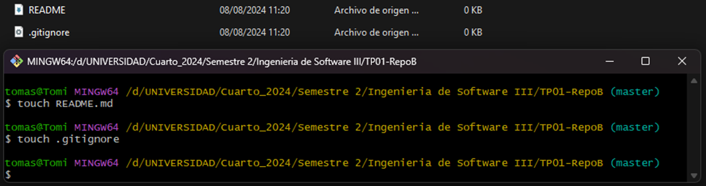 
  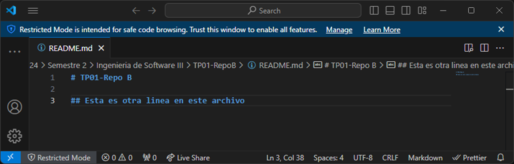 

  - Crear un commit y proveer un mensaje descriptivo
  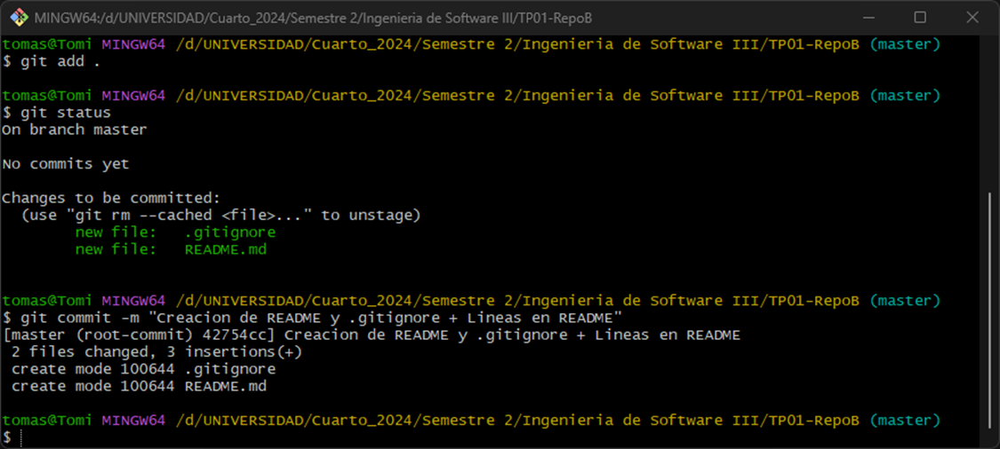 
  
  - Crear repo remoto en GitHub
   

  - Asociar repo local con remoto y Subir cambios.
  
---

### 6- Ramas
  - Crear una nueva rama
  

  - Cambiarse a esa rama
  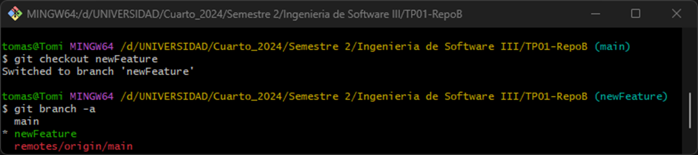
  
  - Hacer un cambio en el archivo Readme.md y hacer commit
  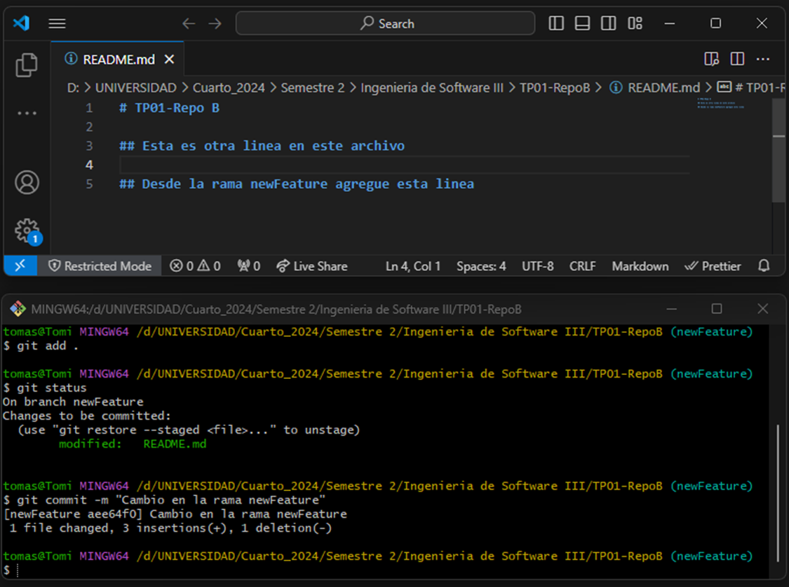

  - Revisar la diferencia entre ramas
  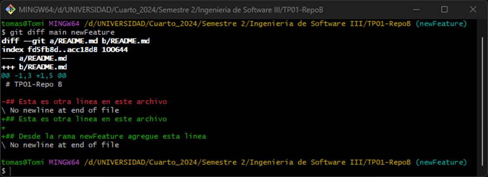

### 7- Merges
  - Hacer un merge FF
  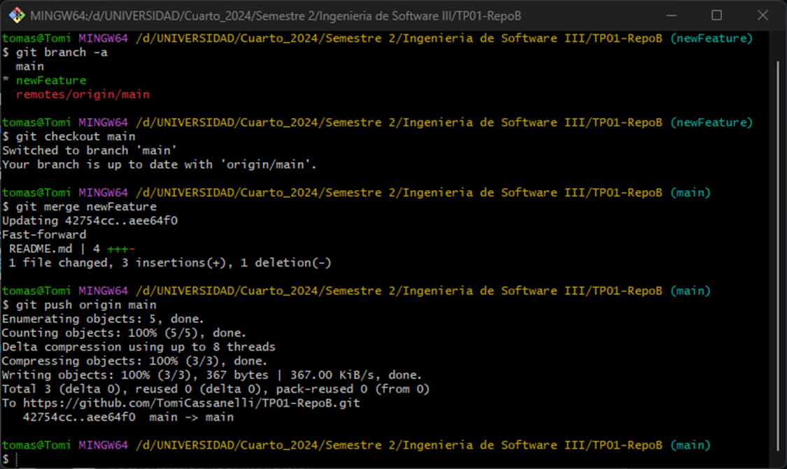

  - Borrar la rama creada
  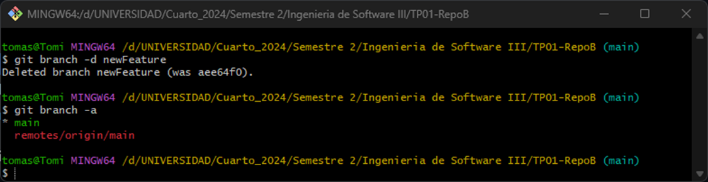

  - Ver el log de commits
  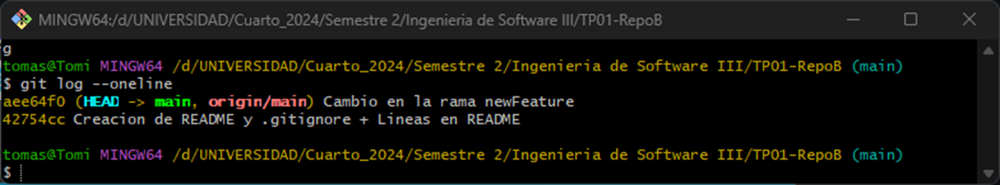

  - Repetir el ejercicio 6 para poder hacer un merge con No-FF
  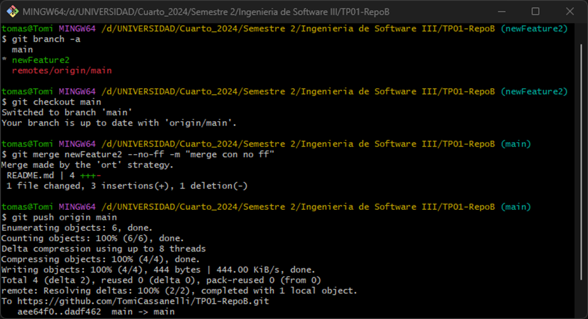
  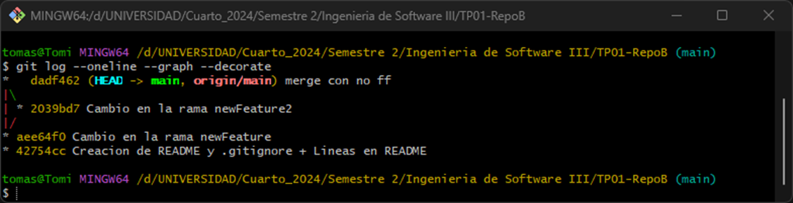