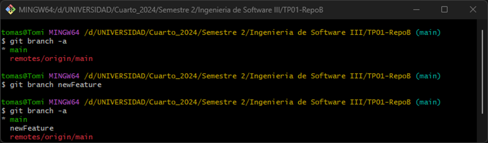
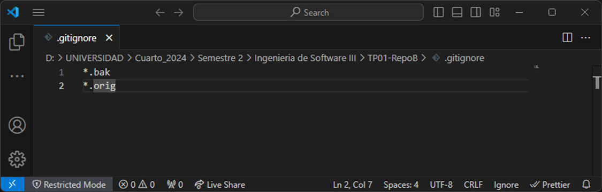

**Alumno:** Tomas Cassanelli  
**Clave UCC:** 2102092

## Trabajo Practico N°1 - Git Básico
---

### 1) Instalar Git
  - Bajar e instalar el cliente git
  
---

### 2) Crear un repositorio local y agregar archivos
  - Crear un repositorio local en un nuevo directorio.
  

  - Agregar un archivo Readme.md, agregar algunas líneas con texto a dicho archivo.
  

  - Crear un commit y proveer un mensaje descriptivo.
  
---

### 3) Configuración del Editor Predeterminado.
---

### 4) Creación de Repos 01 -> Crearlo en GitHub, clonarlo localmente y subir cambios.
  - Crear una cuenta en https://github.com -> https://github.com/TomiCassanelli

  - Crear un nuevo repositorio en dicha página con el Readme.md por defecto.
    
    
  - Clonar el repo remoto en un nuevo directorio local.
  

  - Editar archivo Readme.md agregando algunas lineas de texto.
  

  - Editar (o crear si no existe) el archivo .gitignore agregando los archivos *.bak
  

  - Crear un commit y proveer un mensaje descriptivo.
  

  - Intentar un push al repo remoto.
  

  - En caso de ser necesario configurar las claves SSH requeridas y reintentar el push.
---

### 5) Creación de Repos 02 -> Crearlo localmente y subirlo a GitHub
  - Crear un repo local
   

  - Agregar archivo Readme.md con algunas lineas de texto
  - Crear archivo .gitignore  
   
   

  - Crear un commit y proveer un mensaje descriptivo
   
  
  - Crear repo remoto en GitHub
   

  - Asociar repo local con remoto y Subir cambios.
  
---

### 6) Ramas
  - Crear una nueva rama
  

  - Cambiarse a esa rama
  
  
  - Hacer un cambio en el archivo Readme.md y hacer commit
  

  - Revisar la diferencia entre ramas
  
---

### 7) Merges
  - Hacer un merge FF
  

  - Borrar la rama creada
  

  - Ver el log de commits
  

  - Repetir el ejercicio 6 para poder hacer un merge con No-FF
  
  
---

### 8) Resolución de Conflictos
  - Crear una nueva rama conflictBranch
  

  - Realizar una modificación en la linea 1 del Readme.md desde main y commitear
  
  

  - En la conflictBranch modificar la misma línea del Readme.md y commitear
  
  

  - Ver las diferencias con git difftool main conflictBranch
  
  

  - Cambiarse a la rama main e intentar mergear con la rama conflictBranch
  
  

  - Resolver el conflicto con git mergetool
  
  

  - Agregar .orig al .gitignore
  

  - Hacer commit y push
  
---

### 9) Familiarizarse con el concepto de Pull Request
  - Explicar que es un pull request.

Una PR es un pedido para que los cambios que se hicieron en una rama, se unan al proyecto principal. Entonces, una vez que se trabajó haciendo mejoras o correcciones, se realiza una PR para informar a otros miembros que está listo para ser añadido a la rama principal. Se revisa, y si esta todo en condiciones, esta PR se acepta y se fusionan.

  - Crear un branch local y agregar cambios a dicho branch. 
  

  - Subir el cambio a dicho branch y crear un pull request.
  

  - Completar el proceso de revisión en github y mergear el PR al branch master.
  
  
---

### 10) Algunos ejercicios online
  - Entrar a la página https://learngitbranching.js.org/
  - Completar los ejercicios **Introduction Sequence**
  - Opcional - Completar el resto de los ejercicios para ser un experto en Git!!!
  
---