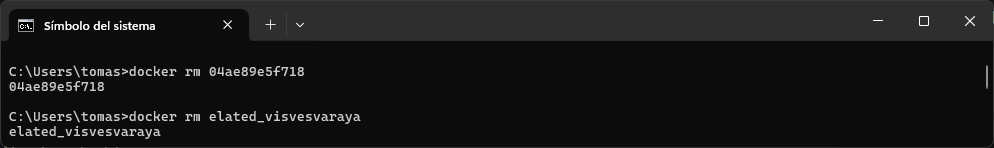
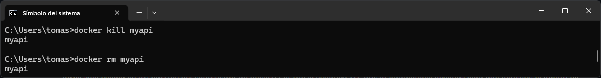

**Alumno:** Tomas Cassanelli  
**Clave UCC:** 2102092

## Trabajo Practico N°2 - Introduccion a Docker
---

### 1- Instalar Docker Community Edition 
  - Ejecutar el siguiente comando para comprobar versiones de cliente y demonio.
```bash
docker version
```

---

### 2- Explorar DockerHub
   - Registrase en docker hub: https://hub.docker.com/


---

### 3- Obtener la imagen BusyBox
  - Ejecutar el siguiente comando, para bajar una imagen de DockerHub
  ```bash
  docker pull busybox
  ```


  - Verificar qué versión y tamaño tiene la imagen bajada, obtener una lista de imágenes locales:
```bash
docker images
```

---

### 4- Ejecutando contenedores
  - Ejecutar un contenedor utilizando el comando **run** de docker:
```bash
docker run busybox
```


  - Explicar porque no se obtuvo ningún resultado

  - Especificamos algún comando a correr dentro del contenedor, ejecutar por ejemplo:
```bash
docker run busybox echo "Hola Mundo"
```


  - Ver los contenedores ejecutados utilizando el comando **ps**:
```bash
docker ps
```


  - Vemos que no existe nada en ejecución, correr entonces:
```bash
docker ps -a
```


  - Mostrar el resultado y explicar que se obtuvo como salida del comando anterior.
---

### 5- Ejecutando en modo interactivo
  - Ejecutar el siguiente comando
```bash
docker run -it busybox sh
```

  - Para cada uno de los siguientes comandos dentro de contenedor, mostrar los resultados:
```bash
ps
uptime
free
ls -l /
```

  - Salimos del contenedor con:
```bash
exit
```

---

### 6- Borrando contenedores terminados
  - Obtener la lista de contenedores 
```bash
docker ps -a
```


  - Para borrar podemos utilizar el id o el nombre (autogenerado si no se especifica) de contenedor que se desee, por ejemplo:
```bash
docker rm elated_lalande
```


  - Para borrar todos los contenedores que no estén corriendo, ejecutar cualquiera de los siguientes comandos:
```bash
docker rm $(docker ps -a -q -f status=exited)
```
```bash
docker container prune
```

---

### 7- Construir una imagen
- Conceptos de DockerFile
  - Leer https://docs.docker.com/engine/reference/builder/ 
  - Describir las instrucciones
     - **FROM:** Es la primera instruccion en el DockerFile. Define la imagen base desde la cual se construirá una nueva.
     - **RUN:** Ejecuta comandos de compilación.
     - **ADD:** Copia archivos o carpetas desde la computadora al contenedor. Puede descomprimir archivos.
     - **COPY:** Solo copia archivos o carpetas sin descomprimir.
     - **EXPOSE:** Indica en qué puerto va a funcionar la aplicación dentro del contenedor.
     - **CMD:** Define el comando que se va a ejecutar cuando se inicie el contenedor.
     - **ENTRYPOINT:** Define un comando que siempre se ejecutará cuando arranque el contenedor. Pueden ser en cadena.

- A partir del código https://github.com/ingsoft3ucc/SimpleWebAPI crearemos una imagen.
- Clonar repo


- Crear imagen etiquetándola con un nombre. El punto final le indica a Docker que use el dir actual
```
docker build -t mywebapi .
```


- Revisar Dockerfile y explicar cada línea


- Ver imágenes disponibles


- Ejecutar un contenedor con nuestra imagen


- Subir imagen a nuestra cuenta de dockerhub
  - 7.1 Inicia sesión en Docker Hub
    - Primero, asegúrate de estar autenticado en Docker Hub desde tu terminal:
    ```bash
    docker login
    ```


  - 7.2 Etiquetar la imagen a subir con tu nombre de usuario de Docker Hub y el nombre de la imagen. Por ejemplo:
    ```bash
    docker tag <nombre_imagen_local> <tu_usuario_dockerhub>/<nombre_imagen>:<tag>
    ```


  - 7.3 Subir la Imagen
    - Para subir la imagen etiquetada a Docker Hub, utiliza el comando docker push:
     ```bash
     docker push <tu_usuario_dockerhub>/<nombre_imagen>:<tag>
     ```


  - 7.4 Verificar la Subida
     ```bash
     docker pull <tu_usuario_dockerhub>/<nombre_imagen>:<tag>
     ```


---

### 8- Publicando puertos

En el caso de aplicaciones web o base de datos donde se interactúa con estas aplicaciones a través de un puerto al cual hay que acceder, estos puertos están visibles solo dentro del contenedor. Si queremos acceder desde el exterior deberemos exponerlos.

  - Ejecutar la siguiente imagen, en este caso utilizamos la bandera -d (detach) para que nos devuelva el control de la consola:
```bash
docker run --name myapi -d mywebapi
```


  - Ejecutamos un comando ps:


  - Vemos que el contendor expone 3 puertos el 80, el 5254 y el 443, pero si intentamos en un navegador acceder a http://localhost/WeatherForecast no sucede nada.


  - Procedemos entonces a parar y remover este contenedor:
```bash
docker kill myapi
docker rm myapi
```


  - Vamos a volver a correrlo otra vez, pero publicando el puerto 80
```bash
docker run --name myapi -d -p 80:80 mywebapi
```


  - Accedamos nuevamente a http://localhost/WeatherForecast y vemos que nos devuelve datos.

---

### 9- Modificar Dockerfile para soportar bash 
- Modificamos dockerfile para que entre en bash sin ejecutar automaticamente la app
 
```bash
#ENTRYPOINT ["dotnet", "SimpleWebAPI.dll"]
CMD ["/bin/bash"]
```
- Rehacemos la imagen
```
docker build -t mywebapi .
```
- Corremos contenedor en modo interactivo exponiendo puerto
```
docker run -it --rm -p 80:80 mywebapi
```
- Navegamos a http://localhost/weatherforecast
- Vemos que no se ejecuta automaticamente
- Ejecutamos app:
```
dotnet SimpleWebAPI.dll
```
-Volvemos a navegar a http://localhost/weatherforecast
- Salimos del contenedor
---
  
### 10- Montando volúmenes
Hasta este punto los contenedores ejecutados no tenían contacto con el exterior, ellos corrían en su propio entorno hasta que terminaran su ejecución. Ahora veremos cómo montar un volumen dentro del contenedor para visualizar por ejemplo archivos del sistema huésped:

  - Ejecutar el siguiente comando, cambiar myusuario por el usuario que corresponda. En Mac puede utilizarse /Users/miusuario/temp):
```bash
docker run -it --rm -p 80:80 -v /Users/miuser/temp:/var/temp  mywebapi
```
  - Dentro del contenedor correr
```bash
ls -l /var/temp
touch /var/temp/hola.txt
```
  - Verificar que el Archivo se ha creado en el directorio del guest y del host.
---

### 11- Utilizando una base de datos
- Levantar una base de datos PostgreSQL

```bash
mkdir $HOME/.postgres

docker run --name my-postgres -e POSTGRES_PASSWORD=mysecretpassword -v $HOME/.postgres:/var/lib/postgresql/data -p 5432:5432 -d postgres:9.4
```
- Ejecutar sentencias utilizando esta instancia

```bash
docker exec -it my-postgres /bin/bash

psql -h localhost -U postgres

#Estos comandos se corren una vez conectados a la base

\l
create database test;
\connect test
create table tabla_a (mensaje varchar(50));
insert into tabla_a (mensaje) values('Hola mundo!');
select * from tabla_a;

\q

exit
```

- Conectarse a la base utilizando alguna IDE (Dbeaver - https://dbeaver.io/, Azure DataStudio -https://azure.microsoft.com/es-es/products/data-studio, etc). Interactuar con los objectos objectos creados.

- Explicar que se logro con el comando `docker run` y `docker exec` ejecutados en este ejercicio.
---

### 12- Hacer el punto 11 con Microsoft SQL Server
- Armar un contenedor con SQL Server
- Crear BD, Tablas y ejecutar SELECT
---