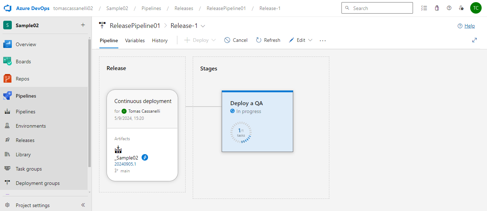

**Alumno:** Tomas Cassanelli  
**Clave UCC:** 2102092

## Trabajo Práctico 5 - Despliegue de aplicaciones con Azure Devops Release Pipelines

### 1- Objetivos de Aprendizaje
 - Adquirir conocimientos acerca de las herramientas de despliegue y releases de aplicaciones.
 - Configurar este tipo de herramientas.
 - Comprender el concepto de recurso en Azure
 - Comprender los conceptos básicos de Release Pipelines en Azure DevOps.
 - Configurar un Release Pipeline para automatizar despliegues en diferentes entornos-

### 2- Unidad temática que incluye este trabajo práctico
Este trabajo práctico corresponde a la unidad Nº: 3 (Libro Continuous Delivery: Cap 10)

### 3- Consignas a desarrollar en el trabajo práctico:
 - Los despliegues (deployments) de aplicaciones se pueden realizar en diferentes tipos de entornos
   - On-Premise (internos) es decir en servidores propios.
   - Nubes Públicas, ejemplo AWS, Azure, Gcloud, etc.
   - Plataformas como servicios (PaaS), ejemplo Heroku, Google App Engine, AWS, Azure WebApp, etc
 - En este práctico haremos despliegue a Plataforma como Servicio utilizando Azure Web Apps

### 4- Desarrollo:
4.1\. Crear una cuenta en Azure

4.2\. Crear un recurso Web App en Azure Portal y navegar a la url provista

4.3\. Actualizar Pipeline de Build para que use tareas de DotNetCoreCLI@2 como en el pipeline clásico, luego crear un Pipeline de Release en Azure DevOps con CD habilitada

4.4\. Optimizar Pipeline de Build

4.5\. Verificar el deploy en la url de la WebApp /weatherforecast

4.6\. Realizar un cambio al código del controlador para que devuelva 7 pronósticos, realizar commit, evaluar ejecución de pipelines de build y release, navegar a la url de la webapp/weatherforecast y corroborar cambio

4.7\. Clonar la Web App de QA para que contar con una WebApp de PROD a partir de un Template Deployment en Azure Portal y navegar a la url provista para la WebApp de PROD.

4.8\. Agregar una etapa de Deploy a Prod en Azure Release Pipelines 

4.9\.  Realizar un cambio al código del controlador para que devuelva 10 pronósticos, realizar commit, evaluar ejecución de pipelines de build y release, navegar a la url de la webapp/weatherforecast y corroborar cambio, verificar que en la url de la webapp_prod/weatherforecast se muestra lo mismo.

4.10\. Modificar pipeline de release para colocar una aprobación manual para el paso a Producción.

4.11\. Realizar un cambio al código del controlador para que devuelva 5 pronósticos, realizar commit, evaluar ejecución de pipelines de build y release, navegar a la url de la webapp/weatherforecast y corroborar cambio, verificar que en la url de la webapp_prod/weatherforecast aun se muestra la versión anterior.

4.12\. Aprobar el pase ya sea desde el release o desde el mail recibido. 

4.13\. Realizar un pipeline (no release) que incluya el deploy a QA y a PROD con una aprobación manual. El pipeline debe estar construido en YAML sin utilizar el editor clásico de pipelines ni el editor clásico de pipelines de release.

### 6-  Presentación del trabajo práctico.
- Subir un doc al repo con las capturas de pantalla de los pasos realizados y tener en el excel de repos (https://docs.google.com/spreadsheets/d/1mZKJ8FH390QHjwkABokh3Ys6kMOFZGzZJ3-kg5ziELc/edit?gid=0#gid=0) la url del proyecto de AzureDevops.
- Aclarar los nombres de los pipelines que se deben evaluar.

### 7-  Criterio de Calificación
Los pasos 4.1 al 4.13 representan un 60% de la nota total, los pasos 4.13 y subsiguientes representan el 40% restante.

### 8-  Documentación y Recursos Adicionales
- https://learn.microsoft.com/en-us/azure/devops/?view=azure-devops

- https://learn.microsoft.com/en-us/azure/devops/pipelines/?view=azure-devops

- https://learn.microsoft.com/en-us/azure/devops/pipelines/yaml-schema/?view=azure-pipelines

- https://learn.microsoft.com/en-us/azure/azure-resource-manager/management/overview

- https://learn.microsoft.com/en-us/azure/azure-resource-manager/templates/overview

