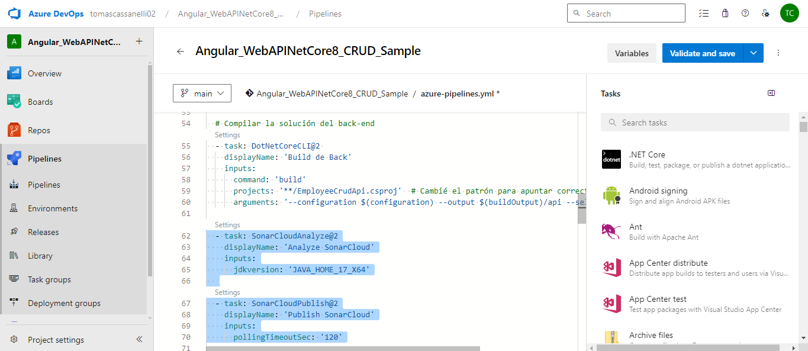
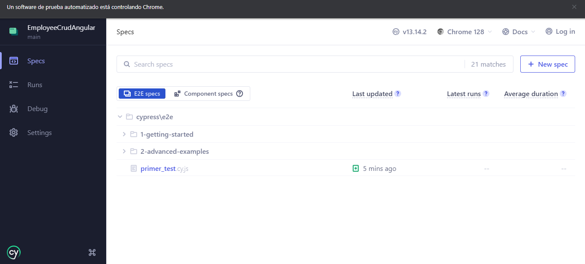
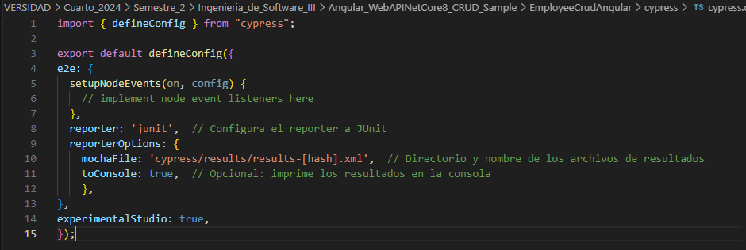
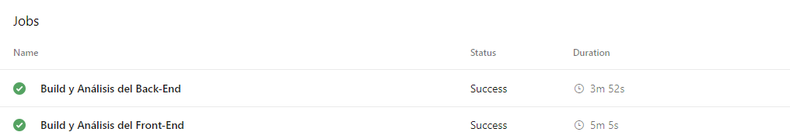
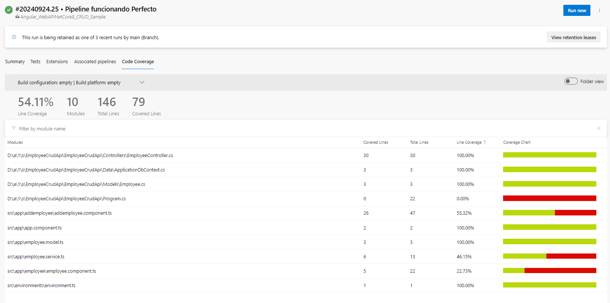

## Trabajo Práctico 7 - Code Coverage, Análisis estático de Código y Pruebas de Integración

### 1- Objetivos de Aprendizaje

### 2- Unidad temática que incluye este trabajo práctico
Este trabajo práctico corresponde a la unidad Nº: 5 (Libro Ingeniería de Software: Cap 8)

### 3- Consignas a desarrollar en el trabajo práctico:

### 4- Desarrollo:
#### Prerequisitos:

#### 4.1 Agregar Code Coverage a nuestras pruebas unitarias de backend y front-end e integrarlas junto con sus resultados en nuestro pipeline de build.

- ##### 4.1.1 En el directorio raiz de nuestro proyecto Angular instalar el siguiente paquete:
	
	
- ##### 4.1.2 Editar nuestro archivo karma.conf.js para que incluya reporte de cobertura
	

- ##### 4.1.3 En el dir raiz del proyecto EmployeeCrudApi.Tests ejecutar:
	

- ##### 4.1.4 Agregar a nuestro pipeline ANTES del Build de Back la tarea de test con los argumentos especificados y la de publicación de resultados de cobertura:
	

- ##### 4.1.5 Agregar a nuestro pipeline ANTES del Build de front la tarea de test y la de publicación de los resultados.
	
	
- ##### 4.1.6 Ejecutar el pipeline y analizar el resultado de las pruebas unitarias y la cobertura de código.

#### 4.2 Agregar Análisis Estático de Código con SonarCloud:
- ##### 4.2.1 Integraremos SonarCloud para analizar el código fuente. Configurar SonarCloud en nuestro pipeline siguiendo instructivo 5.1
	  - Antes de nuestra tarea de Build del Back:
	  

  	  - Despues de nuestra tarea de Build del Back:
	  

- ##### 4.2.2 Vemos el resultado de nuestro pipeline, en extensions tenemos un link al análisis realizado por SonarCloud

- ##### 4.2.3 Ir al link y analizar toda la información obtenida. Detallar en la entrega del TP los puntos más relevantes del informe, qué significan y para qué sirven.

Este informe funciona básicamente como un escáner del código. Nos muestra los issues (problemas) que se encontraron mal en el codigo, como se podria mejorar y cuanto tiempo tardaria en arreglarlas. 
SonarCloud agrupa los problemas en diferentes categorías: Mantenibilidad (4 problemas), Fiabilidad (4 problemas) y Seguridad (1 problema). Cada uno con una gravedad distinta.
SonarCloud nos sirve tambien para poer detectar esos problemas a tiempo, priorizar los arreglos mas criticos, dando como resultado una mejor calidad en el proyecto.

#### 4.3 Pruebas de Integración con Cypress:
- ##### 4.3.1 En el directorio raiz de nuestro proyecto Angular instalar el siguiente paquete:

- ##### 4.3.2 Abrir Cypress:

- ##### 4.3.3 Inicializar Cypress en nuestro proyecto como se indica en el instructivo 5.2

- ##### 4.3.4 Crear nuestra primera prueba navegando a nuestro front.
En la carpeta cypress/e2e, crear un archivo con el nombre primer_test.js y agregar el siguiente código para probar la página de inicio de nuestro front:

- ##### 4.3.5 Correr nuestra primera prueba

También es posible ejecutar Cypress en modo "headless" (sin interfaz gráfica) utilizando el siguiente comando: npx cypress run

- ##### 4.3.6 Modificar nuestra prueba para que falle.
- ###### 4.3.6.1 Editamos el archivo primer_test.cy.js y hacemos que espere otra cosa en el título
	

- ###### 4.3.6.2 Ejecutamos cypress en modo headless
	

Cypress captura automáticamente pantallas cuando una prueba falla. Las capturas de pantalla se guardan en la carpeta `cypress/screenshots`.
	

- ##### 4.3.7 Grabar nuestras pruebas para que Cypress genere código automático y genere reportes:
- ###### 4.3.7.1 Cerramos Cypress y Editamos el archivo cypress.config.ts incluyendo la propiedad **experimentalStudio** en true y la configuración de reportería.

- ###### 4.3.7.2 Corremos nuevamente Cypress con npx cypress open, una vez que se ejecute nuestra prueba tendremos la opción de "Add Commands to Test". Esto permitirá interactuar con la aplicación y generar automáticamente comandos de prueba basados en las interacciones con la página:

- ###### 4.3.7.3 Por ejemplo, si agregamos un nuevo empleado y luego verificamos que esté en la lista, Cypress nos generará un código como este:

- ###### 4.3.7.4 Por supuesto que habrá que hacerle ajustes, como por ejemplo que se fije siempre en la última fila de la grilla y no en la posición 15 como lo grabó, es ahí cuando consultando la documentación de Cypress debemos ver cómo modificar el código, en nuestro caso de ejemplo sería así:

- ##### 4.3.8 Hacemos prueba de editar un empleado
- ###### 4.3.8.1 Creamos en cypress/e2e/ un archivo editEmployee_test.cy.js con el siguiente contenido, guardamos y aparecerá en Cypress:

- ###### 4.3.8.2 Hacemos algunos ajustes al código generado:

#### 4.4 Desafíos:
##### 4.4.1 Integrar en el pipeline SonarCloud para nuestro proyecto Angular, mostrar el resultado obtenido en SonarCloud
En un primer momento, solo tenia una tarea que analizaba el Back, realizado en actividades anteriores, por lo que decidi subdividirlo, un analisis de SonarCloud para Front y otro para Back, bajo la misma Key de SonarCloud.
* Back-End

* Front-End

* Resultados

##### 4.4.2 Implementar en Cypress pruebas de integración que incluya los casos desarrollados como pruebas unitarias del front en el TP06.

##### 4.4.3 Incorporar al pipeline de Deploy la ejecución de las pruebas de integración y la visualización de sus resultados.

Pasos previos para llegar a las siguientes Extras/imagenes: 
- Crear dos WebAPI, uno para Front (con NodeJS) y otro para Back (con NET) desde Azure.
- Cambiar en el codigo del proyecto, todas las URL que digan localhost, por estas nuevas.
- Pipeline con etapa de Deploy:

- **Resultado esperado**:
- Un Pipeline en YAML que incluya a) Build de QA y Front con ejecución y resultado de pruebas de code coverage, pruebas unitarias y análisis de Sonar Cloud y b) Deploy a WebApp(s) de QA y Front que incluya ejecución y resultado de pruebas de integración.

- Dos Stages: Una para Build, Test Unitarios, Code Coverage y SonarCloud y otra para el Deploy a QA con Tests de Integración

- En la pestaña Test, poder visualizar los Test Unitarios de Front y Back y los Test de Integracion:

- En la pestaña Code Coverage, visualizar la cobertura de las pruebas unitarias de Back y de Front:

- En la pestaña Extensions, ver el análisis de SonarCloud en verde

##### 4.4.4 Un documento de una carilla explicando qué información pudieron sacar del análisis de Sonar Cloud y de las pruebas de cobertura.

En este análisis, utilizamos **SonarCloud** y revisamos la cobertura de código de nuestro proyecto **EmployeeAngular_front y EmployeeAngular_back**. Esto es lo que encontré:

**Cobertura Total**
La cobertura de código es del 54.11%, lo que quiere decir que un poco más de la mitad del código está siendo cubierto por nuestras pruebas unitarias y de integración. De las 146 líneas de código, 79 están cubiertas. No está mal, pero claramente se podría mejorar.

El reporte analiza 10 módulos del proyecto. Algunos de estos módulos están cubiertos al 100%, pero otros o están a medias o ni siquiera tienen pruebas, llegando a un 0%. Este es un punto importante que habría que cambiar para tener más control sobre cómo responde el código en caso de cambios o actualizaciones.

**Análisis de SonarCloud**
El análisis de SonarCloud nos trae buenas noticias:

**Quality Gate: Aprobado**
Nuestro proyecto pasó la barrera de calidad. Básicamente, significa que no tenemos problemas graves ni bugs críticos que puedan romper todo. Así que en este aspecto, estaría bien.

**Issues: Todo limpio**
El código está “limpio”, al menos según lo que SonarCloud pudo detectar.

**Seguridad y Duplicaciones**
0 Security Hotspots: No se detectaron vulnerabilidades, lo cual siempre es un alivio. El código parece estar bastante sólido en cuanto a seguridad.
0% de Duplicaciones en el código nuevo: No se encontraron duplicaciones en las líneas nuevas, lo que ayuda a que el código se mantenga ordenado y fácil de mantener.

### 6-  Presentación del trabajo práctico.
- Subir un doc al repo de GitHub con las capturas de pantalla de los pasos realizados. Debe ser un documento (md, word, o pdf), no videos. Y el documento debe seguir los pasos indicados en el Desarrollo del TP.
- Acceso al repo de Azure Devops para revisar el trabajo realizado.

### 7-  Criterio de Calificación
Los pasos 4.1 al 4.3 representan un 60% de la nota total, los pasos 4.4 y subsiguientes representan el 40% restante.

