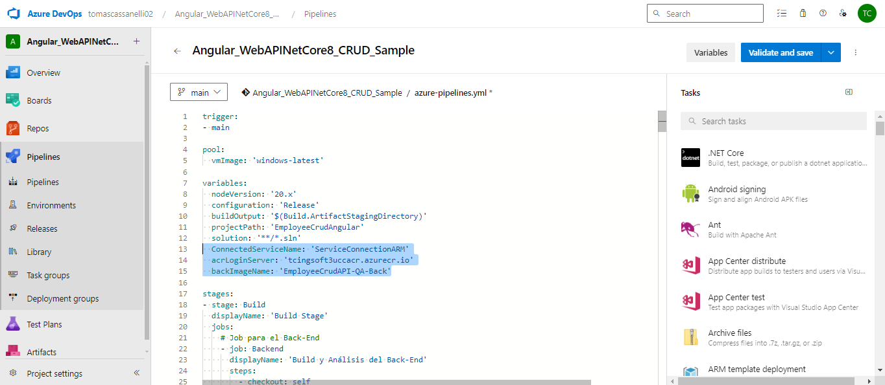
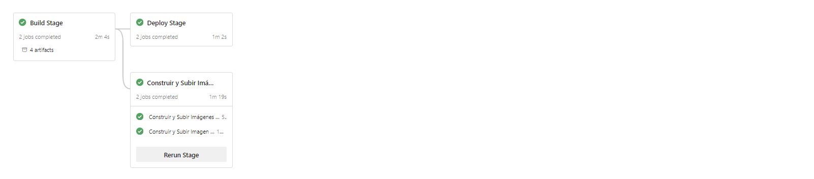
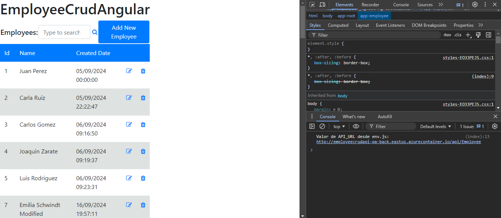
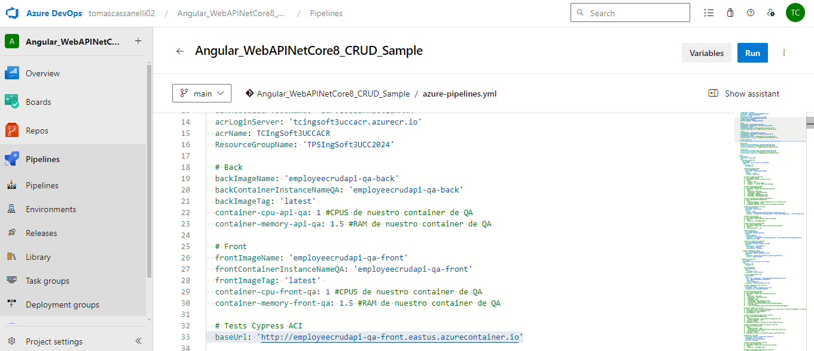
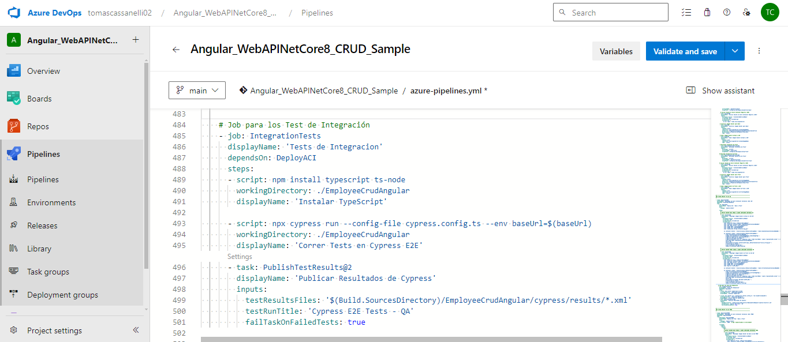
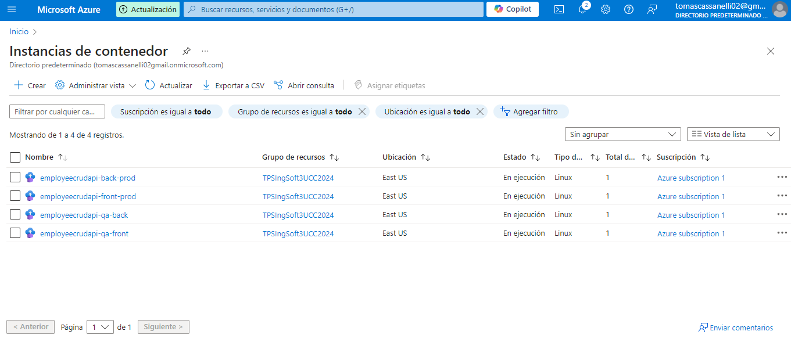
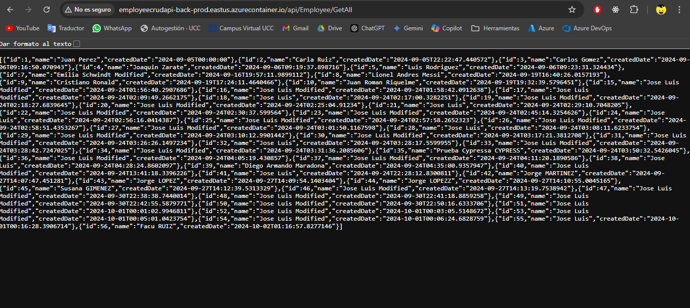

## Trabajo Práctico 8 - Implementación de Contenedores en Azure y Automatización con Azure CLI

### 1- Objetivos de Aprendizaje

Al finalizar esta sesión, los estudiantes serán capaces de:

1. **Seleccionar el servicio de contenedores más adecuado para diferentes escenarios de despliegue en la nube.**
2. **Configurar y utilizar Azure Container Registry (ACR) para almacenar imágenes Docker de manera segura.**
3. **Automatizar la creación y gestión de recursos en Azure mediante scripts y comandos de Azure CLI.**
4. **Utilizar variables y secretos de manera eficiente y segura en los pipelines de Azure DevOps.**
5. **Desarrollar y ejecutar un pipeline CI/CD completo que incluya la construcción y despliegue de contenedores en Azure.**

### 2- Unidad temática que incluye este trabajo práctico
Este trabajo práctico corresponde a la unidad Nº: 2 (Libro Ingeniería de Software: Unidad 18)

### 3- Consignas a desarrollar en el trabajo práctico:
---

### 4- Desarrollo:
#### Prerequisitos:
 - Azure CLI instalado 

#### 4.1 Modificar nuestro pipeline para construir imágenes Docker de back y front y subirlas a ACR
- ##### 4.1.1 Crear archivos DockerFile para nuestros proyectos de Back y Front. En la raiz de nuestro repo crear una carpeta docker con dos subcarpetas api y front, dentro de cada una de ellas colocar los dockerfiles correspondientes para la creación de imágenes docker en función de la salida de nuestra etapa de Build y Test

- DockerFile Back:

- DockerFile Front:

- ##### 4.1.2 Crear un recurso ACR en Azure Portal siguiendo el instructivo 5.1

- ##### 4.1.3 Modificar nuestro pipeline en la etapa de Build y Test
- Luego de la tarea de publicación de los artefactos de Back agregar la tarea de publicación de nuestro dockerfile de back para que esté disponible en etapas posteriores:

- Luego de la tarea de publicación de los artefactos de Front agregar la tarea de publicación de nuestro dockerfile de front para que esté disponible en etapas posteriores:

- ##### 4.1.4 En caso de no contar en nuestro proyecto con una ServiceConnection a Azure Portal para el manejo de recursos, agregar una service connection a Azure Resource Manager como se indica en instructivo 5.2 

- ##### 4.1.5 Agregar a nuestro pipeline variables 

- ##### 4.1.6 Agregar a nuestro pipeline una nueva etapa que dependa de nuestra etapa de Build y Test
- Agregar tareas para generar imagen Docker de Back

- ##### 4.1.7 - Ejecutar el pipeline y en Azure Portal acceder a la opción Repositorios de nuestro recurso Azure Container Registry. Verificar que exista una imagen con el nombre especificado en la variable backImageName asignada en nuestro pipeline

- ##### 4.1.8 - Agregar tareas para generar imagen Docker de Front (DESAFIO)
- ###### 4.1.8.1 A la etapa creada en 4.1.6 Agregar tareas para generar imagen Docker de Front

- ##### 4.1.9 - Agregar a nuestro pipeline una nueva etapa que dependa de nuestra etapa de Construcción de Imagenes Docker y subida a ACR

- ###### 4.1.9.1 Agregar variables a nuestro pipeline:

- ###### 4.1.9.2 Agregar variable secreta cnn-string-qa desde la GUI de ADO que apunte a nuestra BD de SQL Server de QA como se indica en el instructivo 5.3

  	    
- ###### 4.1.9.3 Agregar tareas para crear un recurso Azure Container Instances que levante un contenedor con nuestra imagen de back

- ##### 4.1.10 - Ejecutar el pipeline y en Azure Portal acceder al recurso de Azure Container Instances creado. Copiar la url del contenedor y navegarlo desde browser. Verificar que traiga datos.

- ##### 4.1.11 - Agregar tareas para generar un recurso Azure Container Instances que levante un contenedor con nuestra imagen de front (DESAFIO)
- A la etapa creada en 4.1.9 Agregar tareas para generar contenedor en ACI con nuestra imagen de Front

- Tener en cuenta que el contenedor debe recibir como variable de entorno API_URL el valor de una variable container-url-api-qa definida en nuestro pipeline.

- Para que el punto anterior funcione el código fuente del front debe ser modificado para que la url de la API pueda ser cambiada luego de haber sido construída la imagen. Se deja un ejemplo de las modificaciones a realizar en el repo https://github.com/ingsoft3ucc/CrudAngularConEnvironment.git

- ##### 4.1.12 - Agregar tareas para correr pruebas de integración en el entorno de QA de Back y Front creado en ACI. (DESAFIO)

- ##### 4.1.13 - Agregar etapa que dependa de la etapa de Deploy en ACI QA y genere contenedores en ACI para entorno de PROD. (DESAFIO)

### 6-  Presentación del trabajo práctico.
- Subir un doc al repo de GitHub con las capturas de pantalla de los pasos realizados. Debe ser un documento (md, word, o pdf), no videos. Y el documento debe seguir los pasos indicados en el Desarrollo del TP.
- Acceso al repo de Azure Devops para revisar el trabajo realizado.

### 7-  Criterio de Calificación
Los pasos 4.1 al 4.X representan un 60% de la nota total, los pasos 4.X y subsiguientes representan el 40% restante.

### 8-  Recursos Adicionales
