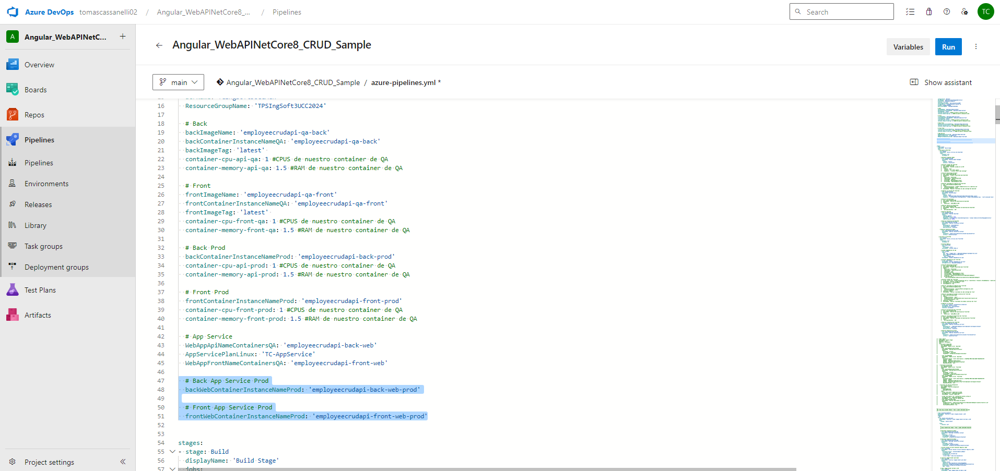
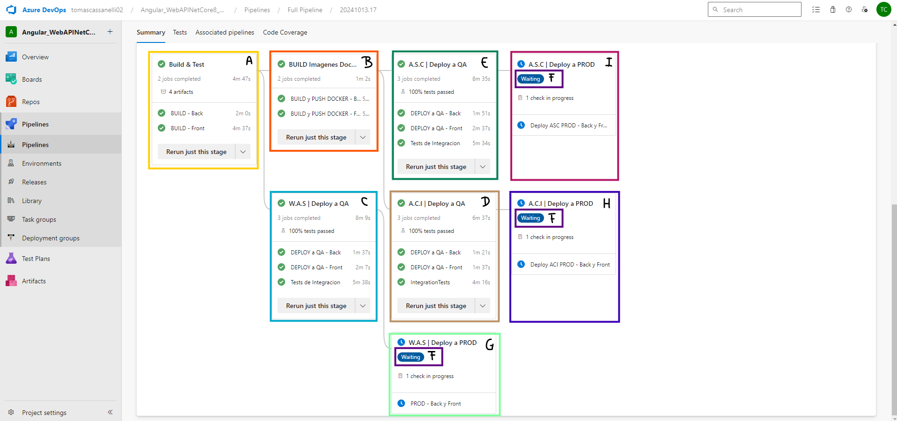

## Trabajo Práctico 9 - Implementación de Contenedores en Azure Parte 2

### 1- Objetivos de Aprendizaje

Al finalizar esta sesión, los estudiantes serán capaces de:

1. **Seleccionar el servicio de contenedores más adecuado para diferentes escenarios de despliegue en la nube.**
2. **Configurar y utilizar Azure Container Registry (ACR) para almacenar imágenes Docker de manera segura.**
3. **Automatizar la creación y gestión de recursos en Azure mediante scripts y comandos de Azure CLI.**
4. **Utilizar variables y secretos de manera eficiente y segura en los pipelines de Azure DevOps.**
5. **Desarrollar y ejecutar un pipeline CI/CD completo que incluya la construcción y despliegue de contenedores en Azure.**

### 2- Unidad temática que incluye este trabajo práctico
Este trabajo práctico corresponde a la unidad Nº: 2 (Libro Ingeniería de Software: Unidad 18)

### 3- Consignas a desarrollar en el trabajo práctico:

### 4- Desarrollo:

#### 4.1 Modificar nuestro pipeline para incluir el deploy en QA y PROD de Imagenes Docker en Servicio Azure App Services con Soporte para Contenedores

- ##### 4.1.1 - Agregar a nuestro pipeline una nueva etapa que dependa de nuestra etapa de Construcción y Pruebas y de la etapa de Construcción de Imagenes Docker y subida a ACR realizada en el TP08
- ###### 4.1.1.1 Agregar tareas para crear un recurso Azure Container Instances que levante un contenedor con nuestra imagen de back utilizando un AppServicePlan en Linux

#### 4.2 Desafíos:
- ##### 4.2.1 Agregar tareas para generar Front en Azure App Service con Soporte para Contenedores

- ##### 4.2.2 Agregar variables necesarias para el funcionamiento de la nueva etapa considerando que debe haber 2 entornos QA y PROD para Back y Front.

- ##### 4.2.3 Agregar tareas para correr pruebas de integración en el entorno de QA de Back y Front creado en Azure App Services con Soporte para Contenedores. 

- ##### 4.2.4 Agregar etapa que dependa de la etapa de Deploy en QA que genere un entorno de PROD.

- ##### 4.2.5 Entregar un pipeline que incluya:
A partir de este punto, tenia completo todo, pero me dediqué a reorganizar y optimizar todo el pipeline, para eso, cree un segundo pipeline en donde estandaricé el formato de las URLs, las variables y los títulos de las etapas, por lo que algunos nombres y URLs pueden ser distintos de los anteriores TPs y capturas. Esto lo hice para garantizar que la entrega final sea clara, coherente y fácil de leer. Entonces, hasta ahora, cuento con dos pipelines:

* Pipeline de Desarrollo: Incluye todo el historial de cambios realizados a lo largo de los trabajos prácticos (TP) 5, 6, 7, 8 y 9.
* Pipeline Completo y Organizado: Contiene todo lo anterior, pero optimizado y perfeccionado.

En cada uno de esos pipelines, existen los siguientes puntos:
  - A) Etapa Construcción y Pruebas Unitarias y Code Coverage Back y Front
  - B) Construcción de Imágenes Docker y subida a ACR
  - C) Deploy Back y Front en QA con pruebas de integración para Azure Web Apps
  - D) Deploy Back y Front en QA con pruebas de integración para ACI
  - E) Deploy Back y Front en QA con pruebas de integración para Azure Web Apps con Soporte para contenedores
  - F) Aprobación manual de QA para los puntos C,D,E
  - G) Deploy Back y Front en PROD para Azure Web Apps
  - H) Deploy Back y Front en PROD para ACI
  - I) Deploy Back y Front en PROD para Azure Web Apps con Soporte para contenedores

Para finalizar este Trabajo Practico Integrador, desarrollé un nuevo pipeline que emplea templates.

Resultados de TODOS los Front, comunicandose exitosamente con sus respectivos Back:

### 6-  Presentación del trabajo práctico.
- Subir un doc al repo de GitHub con las capturas de pantalla de los pasos realizados. Debe ser un documento (md, word, o pdf), no videos. Y el documento debe seguir los pasos indicados en el Desarrollo del TP.
- Acceso al repo de Azure Devops para revisar el trabajo realizado.

### 7-  Criterio de Calificación
El paso 4.1 representa un 20% de la nota total, el paso 4.2 representa el 80% restante.

